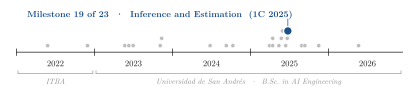
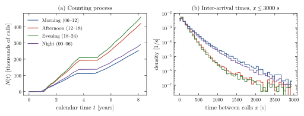
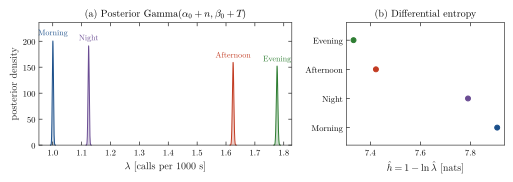
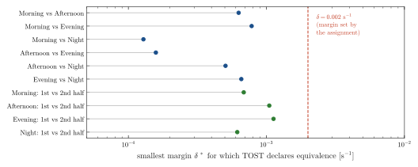

<div align="center">

# Poisson Modelling of Seattle 911 Call Arrivals by Time of Day

**Santiago Groba Alonso** · Valentino N. Fadel · [Joaquín Gustavo Di Cola](https://github.com/joaco1212004)

Universidad de San Andrés · *Inference and Estimation* · First semester 2025 · Assignment 3

[](#reproducing-the-results)
[](#reproducing-the-results)

<picture>
  <source media="(prefers-color-scheme: dark)" srcset="docs/figures/trajectory-dark.svg">
  
</picture>

</div>

> **Abstract.** We model the arrival of calls to the Seattle Police Department's 911 service as a Poisson process, separately for four six-hour bands of the day, using 1.42 million inter-arrival times recorded over eight years. The arrival rate is estimated by maximum likelihood and as the mean of a conjugate Gamma posterior; with this much data the two differ by less than $5\times10^{-9}$ s⁻¹. The evening band has the highest rate, $1.777\times10^{-3}$ calls per second of calendar time, 1.78 times that of the morning band, and the differential entropy of the inter-arrival time, $1 - \ln\hat\lambda$, ranks the bands in the opposite order. In two one-sided equivalence tests (TOST), the margin set by the assignment, 0.002 s⁻¹, is wider than every rate, so it cannot separate any pair of bands; the margin at which two bands become equivalent ranges from $1.3\times10^{-4}$ to $7.8\times10^{-4}$ s⁻¹. The data also show the limits of a single homogeneous rate: the counting process has long gaps, the inter-arrival times are more dispersed than an exponential, and within each band the second half of the record has 1.7 to 1.9 times the rate of the first.

---

## 1. Problem

`911_times.csv` holds, for each band (morning 06–12 h, afternoon 12–18 h, evening 18–24 h, night 00–06 h), the times in seconds of the calls in that band, measured from the first one. The assignment asks to

1. check whether the arrivals look like a Poisson process (counting process, histogram and box plots of the inter-arrival times);
2. estimate the rate $\lambda$ of each band by maximum likelihood, $\hat\lambda_\mathrm{MLE} = n / \sum_i x_i$, and by Bayesian inference with a $\mathrm{Gamma}(\alpha_0, \beta_0)$ prior, whose posterior is $\mathrm{Gamma}(\alpha_0 + n, \beta_0 + \sum_i x_i)$;
3. derive the differential entropy of an exponential inter-arrival time, $h(X) = 1 - \ln\lambda$, and evaluate it for each band;
4. test whether the rates of two bands are equivalent within a margin $\delta$ with TOST: $H_0: \lvert\lambda_1 - \lambda_2\rvert \geq \delta$ against $H_1: \lvert\lambda_1 - \lambda_2\rvert < \delta$, using $Z_{A,B} = (\hat\lambda_1 - \hat\lambda_2 \pm \delta)/\mathrm{SE}$ with $\mathrm{SE}^2 = \hat\lambda_1^2/n_1 + \hat\lambda_2^2/n_2$.

## 2. Methods

| Component | Choice |
|---|---|
| Data | Seattle Police Department 911 incident responses (Kaggle), one column of call times per band |
| Inter-arrival times | Consecutive differences of each column; all of them for estimation, those up to 3000 s for the plots |
| Estimators | MLE $n/T$; posterior mean $(\alpha_0 + n)/(\beta_0 + T)$ with $\alpha_0 = \beta_0 = 1$ |
| Entropy | Plug-in $\hat h = 1 - \ln\hat\lambda_\mathrm{MLE}$, in nats with $\lambda$ in s⁻¹ |
| TOST | $\alpha = 0.05$, margin $\delta = 0.002$ s⁻¹ set by the assignment; between bands and between the two halves of each band |

## 3. Results

### 3.1 Is it a Poisson process?

<p align="center"></p>

**Figure 1.** (a) Number of calls $N(t)$ against calendar time for the four bands. (b) Density of the inter-arrival times up to 3000 s (99.1–99.5 % of them), on a log scale, in 60 s bins centred on whole minutes because most timestamps are whole minutes.

Over short stretches $N(t)$ grows linearly, as a homogeneous Poisson process would, but not over the full record: in every band the first year has few or no calls, and so does a stretch of more than a year between years 3.7 and 4.9; the assignment itself warns that long gaps may come from periods without records. On the log scale an exponential density would be a straight line; the observed curves bend upwards, and the coefficient of variation of the plotted intervals is 1.14–1.24 instead of 1, consistent with a rate that changes over time. Between 12 % and 19 % of the intervals are exactly zero: many calls share a timestamp, since most are recorded to the minute.

### 3.2 Rates and entropy

**Table 1.** Rate estimates per band. $T = \sum_i x_i$ is the total observed time; the credible interval is the central 95 % of the posterior.

| Band | $n$ | $T$ [s] | $\hat\lambda_\mathrm{MLE}$ [s⁻¹] | $\hat\lambda_\mathrm{Bayes}$ [s⁻¹] | 95 % credible interval [10⁻³ s⁻¹] | $\hat h$ [nats] |
|---|---:|---:|---:|---:|---:|---:|
| Morning (06–12) | 252,683 | 252,563,041 | 0.001000475 | 0.001000479 | [0.997, 1.004] | 7.907 |
| Afternoon (12–18) | 420,254 | 258,687,684 | 0.001624561 | 0.001624565 | [1.620, 1.629] | 7.423 |
| Evening (18–24) | 459,350 | 258,519,941 | 0.001776846 | 0.001776849 | [1.772, 1.782] | 7.333 |
| Night (00–06) | 289,978 | 257,920,893 | 0.001124290 | 0.001124294 | [1.120, 1.128] | 7.791 |

<p align="center"></p>

**Figure 2.** (a) Posterior distribution of the rate of each band; with $n$ between 250,000 and 460,000 the posteriors are narrow and far apart. (b) Plug-in differential entropy of the inter-arrival time: the busier the band, the lower the entropy.

The times in each column run continuously over the eight years, so every band includes about 2,080 overnight gaps of roughly 18 hours between the end of one day's window and the start of the next. The rates above are therefore averages over calendar time; inside its six-hour window each band is about four times busier.

### 3.3 Equivalence tests

For a pair of bands, TOST declares equivalence at level $\alpha$ exactly when $\delta$ exceeds $\delta^* = \lvert\hat\lambda_1 - \hat\lambda_2\rvert + z_{0.95}\,\mathrm{SE}$, so $\delta^*$ summarizes the test for every possible margin.

<p align="center"></p>

**Figure 3.** Smallest margin $\delta^*$ for which TOST ($\alpha = 0.05$) declares two rates equivalent, between bands (blue) and between the first and second half of the intervals of each band (green), computed from the inter-arrival times with the formulas of Section 1.

The margin set by the assignment, $\delta = 0.002$ s⁻¹, is larger than any of the four rates, so it makes every pair formally equivalent, including bands whose rates differ by a factor of 1.78. Margins of the order of the differences themselves are more informative: morning and night ($\delta^* = 1.3\times10^{-4}$ s⁻¹) and afternoon and evening ($1.6\times10^{-4}$) are the closest pairs, while the two halves of a single band need $6.2\times10^{-4}$ to $1.1\times10^{-3}$ s⁻¹, as much as or more than the most different bands, because the rate grows by a factor of 1.7 to 1.9 from the first to the second half of the record. The statistics in Tables 3–4 of the report differ from these: in `codeEJ4.ipynb` the rates were computed from the call times themselves rather than from the intervals between them.

## 4. Takeaways

- The time of day matters: the evening rate is 78 % higher than the morning rate, and the posterior intervals are far from overlapping.
- With over 250,000 observations per band, a Gamma(1, 1) prior changes the estimate only in the ninth decimal; the Bayesian machinery pays off with small samples, not here.
- An equivalence test is only as meaningful as its margin, which has to be set on the scale of the quantity being compared; reporting $\delta^*$ avoids choosing it blindly.
- A single rate per band hides changes over the years that are as large as the differences between bands. A natural next step is a rate that also depends on the date, for example estimated per month.

## Reproducing the results

```bash
pip install numpy pandas scipy matplotlib jupyter
jupyter notebook code.ipynb          # exercises 1–3
jupyter notebook codeEJ4.ipynb       # exercise 4 (TOST)
python docs/figures/make_figures.py  # figures and tables of this README
```

| File | Content |
|---|---|
| `911_times.csv` | Call times in seconds for the four bands (17 MB) |
| `code.ipynb` | Exercises 1–3: exploration, rate estimation, entropy |
| `codeEJ4.ipynb` | Exercise 4: TOST between bands and within each band |
| `TP3_G05.PDF`, `Informe.tx` | Report (Spanish) and its LaTeX source |
| `TP3_G05.ZIP` | Notebooks as submitted |
| `figs/` | Figures of the report |
| `docs/figures/` | Script and style used for the figures in this README |

## Citation

```bibtex
@misc{groba2025poisson911,
  author       = {Groba Alonso, Santiago and Fadel, Valentino N. and Di Cola, Joaqu{\'i}n Gustavo},
  title        = {Poisson Modelling of Seattle 911 Call Arrivals by Time of Day},
  year         = {2025},
  howpublished = {Universidad de San Andr{\'e}s, Inference and Estimation},
  url          = {https://github.com/Santi2065/poisson-911-calls}
}
```
